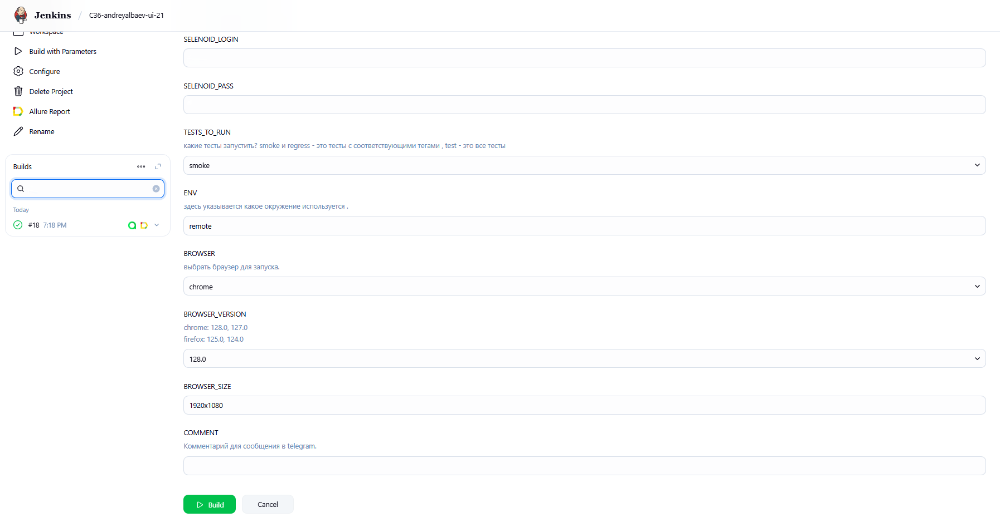
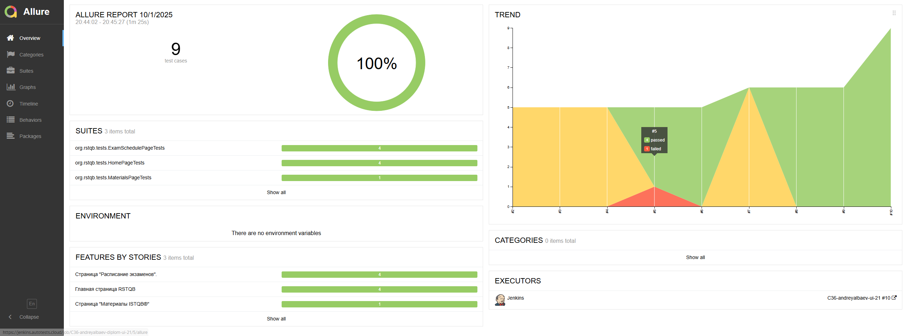
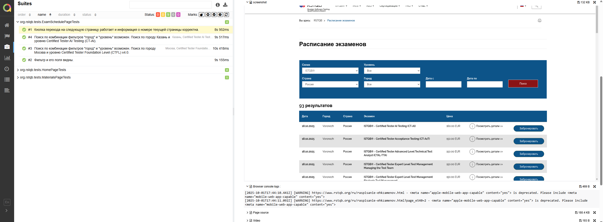
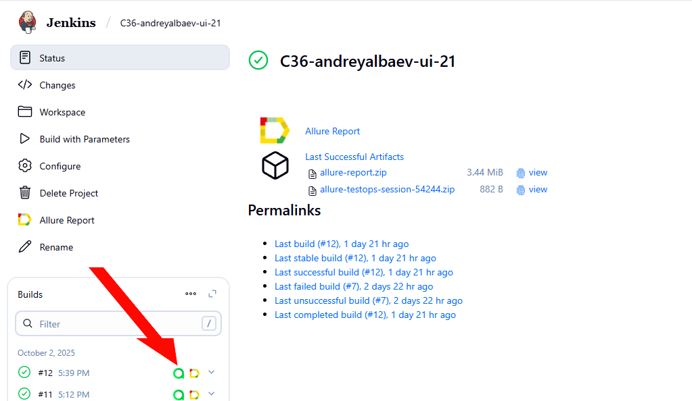
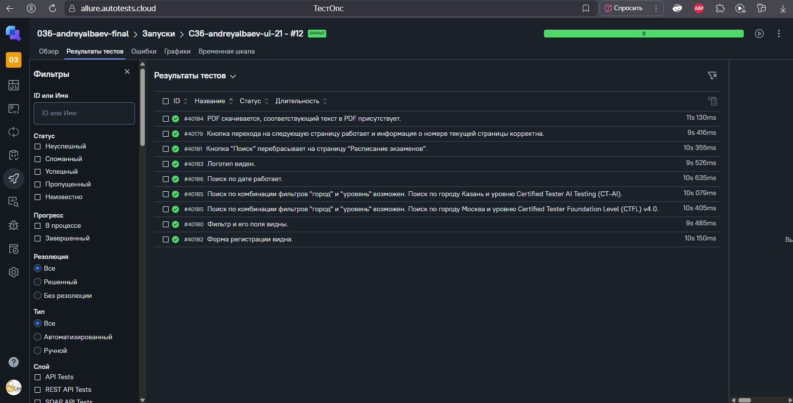
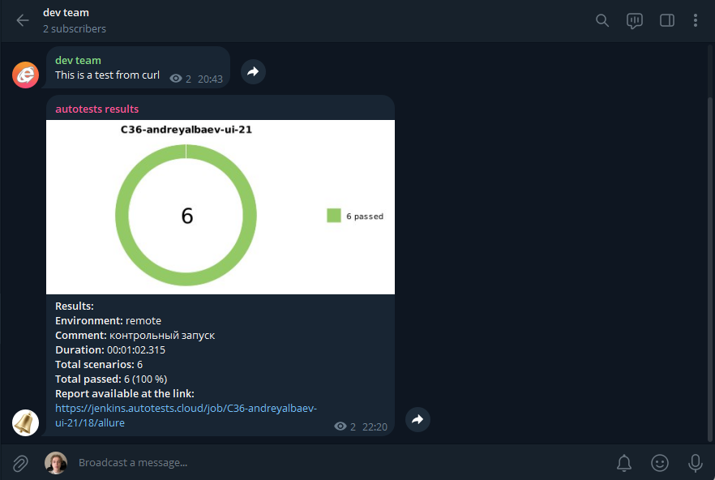

<div align="center">

# Проект мобильных автотестов для приложения Wikipedia


</div>

---

## 📖 Содержание

- [🧩 Используемые технологии в проекте](#технологии)
- [🧪 Тест-кейсы](#тест-кейсы)
- [🚀 Запуск автотестов через терминал](#запуск-автотестов-через-терминал)
- [⚙️ Сборка Jenkins](#сборка-jenkins)
- [📊 Allure](#allure)
- [📊+🧪 Allure TestOps](#testops)
- [🔔 Telegram](#telegram)
- [🎥 Видеопример выполнения теста на Browserstack](#browserstack)

---

<div align="center">

<h2>Используемые технологии в проекте</h2>

<table>
  <tr>
    <td align="center"><br>Java</td>
    <td align="center"><br>GitHub</td>
    <td align="center"><br>Gradle</td>
    <td align="center"><br>Android</td>
    <td align="center"><br>Appium</td>
    <td align="center"><br>Browserstack</td>
    <td align="center"><br>Selenide</td>
    <td align="center"><br>IntelliJ IDEA</td>
    <td align="center"><br>JUnit5</td>
    <td align="center"><br>Lombok</td>
    <td align="center"><br>Allure Report</td>
    <td align="center"><br>Allure TestOps</td>
    <td align="center"><br>Jenkins</td>
    <td align="center"><br>Telegram</td>
  </tr>
</table>

</div>

---

<a id="тест-кейсы"></a>

## 🧪 Тест-кейсы

- ✅ Выполнение поиска со страницы "Explore" и переход на страницу результата поиска.
- ✅ Все элементы поиска на странице \"Explore\" присутствуют.
- ✅ Отображение вкладок на tab bar.

___
<a id="запуск-автотестов-через-терминал"></a>

## 🚀 Запуск автотестов через терминал на локальном эмуляторе

### Предварительно требуется

    1.Установить Android Studio
    2.В Android Studio -> SDK Manager скачать android 11
    3.В AVD Manager скачать образ Pixel 4 для 11 андроида 
    4.Установить node.js
    5.Установить Appium Server
    6.Установить драйвер uiautomator2

7. Запустить Appium Server
```bash
   appium server --base-path /wd/hub
```

8. Запустить эмулятор Pixel 4
```bash
   ${absolute path to app mobile-demo-tests\src\test\resources\apps\wiki.apk} -avd Pixel_4 -no-snapshot-load
```

9. Установить приложение на эмулятор (если еще не установлено)
```bash
   adb install ${absolute path to app mobile-demo-tests\src\test\resources\apps\wiki.apk}
```

10. Запустить приложение на эмуляторе
```bash
   adb shell am start -n org.wikipedia.alpha/org.wikipedia.main.MainActivity
```

### Запускаем тесты

regress
```bash
   regress_emulator_android_wiki_task
```
smoke
```bash
   smoke_emulator_android_wiki_task
```
all
```bash
   all_emulator_android_wiki_task
```


---


## Запуск автотестов с локальной машины на BrowserStack
### Предварительно требуется

1. Зарегистрироваться на BrowserStack
2. Загрузить приложение на BrowserStack аккаунт (требуется только в первый раз)

```powershell 
curl.exe -u "${BrowserStackUser}:${BrowserStackKey}" -X POST "https://api-cloud.browserstack.com/app-automate/upload" -F "file=@${absolute path to app mobile-demo-tests\src\test\resources\apps\wiki.apk}" -F "custom_id=WikiApp" -k
```
3. Запустить одну из тасок 

regress
```bash
./gradlew clean -Dbrowserstack.user=${BrowserStackUser} -Dbrowserstack.key=${BrowserStackKey} regress_browserStack_android_wiki_task
```
smoke
```bash
./gradlew clean -Dbrowserstack.user=${BrowserStackUser} -Dbrowserstack.key=${BrowserStackKey} smoke_browserStack_android_wiki_task
```
all
```bash
./gradlew clean -Dbrowserstack.user=${BrowserStackUser} -Dbrowserstack.key=${BrowserStackKey} all_browserStack_android_wiki_task
```

### Получить Allure отчёт

```bash
  ./gradlew allureServe
```

___

<a id="сборка-jenkins"></a>

##  </a> Сборка в <a target="_blank" href="https://jenkins.autotests.cloud/"> Jenkins </a>

Jenkins job-а для запуска автотестов этого проекта
располагается <a target="_blank" href="https://jenkins.autotests.cloud/job/C36-andreyalbaev-ui-21"> здесь</a>. Для
запуска сборки необходимо нажать на <code>Build with parameters</code>, выбрать необходимые параметры и нажать
кнопку <code>Build</code>.

### Параметры сборки в Jenkins:

- BROWSER_STACK_USER
- BROWSER_STACK_KEY
- TESTS_TO_RUN

<div align="center">



</div>


❗После выполнения сборки формируются <code>Allure Report</code> - HTML отчёт о прошедших тестах и тестовые прогоны в
TMS <code>Allure TestOps</code>.

---
<a id="allure"></a>

##  </a>  Allure

### Пример отчёта



Как уже было сказано ранее, отчёт формируется автоматически после прогона автотестов.

### Allure attachments

Также после выполнения тестов к отчёту добавляются:

1) Скриншот окна перед закрытием драйвера
2) Логи консоли браузера
3) HTML страницы перед закрытием драйвера
4) Видео выполнения автотеста

На скриншоте ниже это видно в правой части экрана.



---
<a id="testops"></a>

##  </a>  Allure TestOps

Это TMS, которую можно интегрировать, например, с Jenkins и Jira, в данном проекте интегрировано с Jenkins: в TestOps
автоматически выгружаются результаты прохождения автотестов после выполнения job-ы в Jenkins.

<div align="center">


</div>
<div align="center">


</div>

---

<a id="telegram"></a>

##  </a>  Telegram уведомления

К проекту также подключен бот , который по завершении прогона автотестов посылает краткую сводку и ссылку на allure
отчёт в telegram<a target="_blank" href="https://t.me/esttonami"> чат</a>.


<div align="center">


</div>

--- 

<a id="browserstack"></a>

##  </a> Видеопример выполнения теста на Browserstack

Видео сохраняется для каждого теста в Allure отчёте
